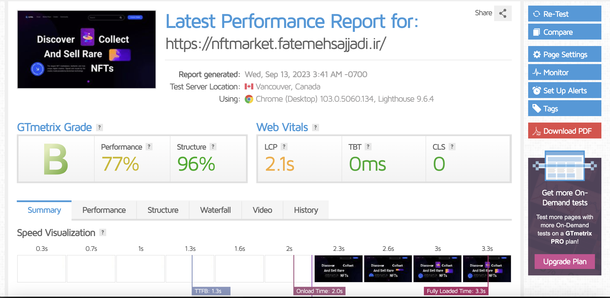

# NFT Market

this is a NFT Market maked by ReactJS

i programming this website design from https://dribbble.com and i dont copy from others anyway

i dont fork this project source code from any github repoistory...

this website do not have a backend and i develop a part of website


## 🛠 Skills
Javascript (ReactJS), HTML, CSS...


## Demo

Demo of project

https://nftmarket.fatemehsajjadi.ir

## Dribbble Source for this React Project

https://dribbble.com/shots/17348827-Luval-NFT-Marketplace

## Installation

Install nft-market ReactProject with yarn

```bash
  cd nft-market
  yarn install
  yarn start
```
    

## Deployment

To deploy this project run

```bash
  cd nft-market
  yarn run build
  then zip the build folder then upload to your host
  unzip build.zip then use it
```


## Screenshots





## License

[MIT](https://choosealicense.com/licenses/mit/)


## 🚀 About Me
I'm a full stack developer (fatemeh sajjadi)

- ReactJS Basic
- Laravel MidLevel
- linux server managment
- android development midlevel
## 🔗 Links
[fatemehsajjadi.ir](https://fatemehsajjadi.ir/)

[](https://www.linkedin.com/in/fatemeh-sadat-sajjadi/)